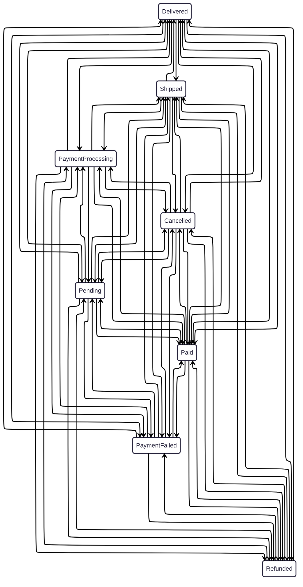
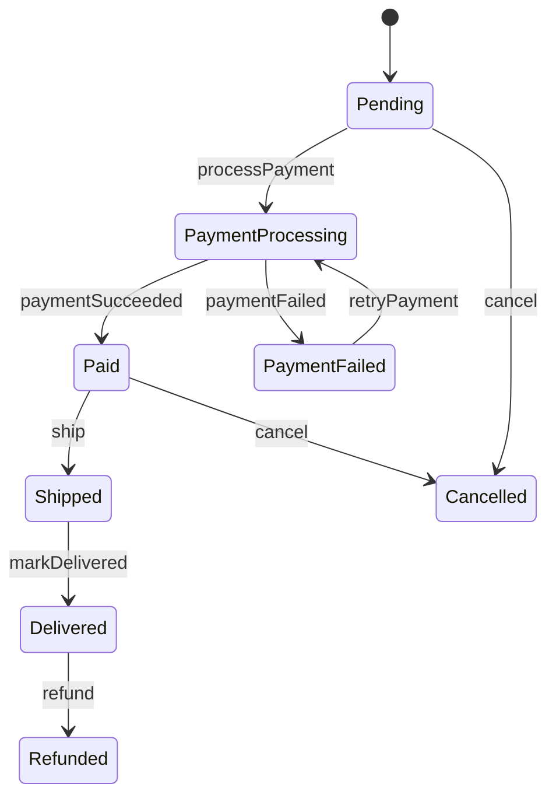

---                                                                                                                                                                              
title: "65,271 Ways to be wrong."                                                                                                         
description: "You Don't Just Have a State Problem, You Have a Transitions Problem."
date: 2026-03-07
---                                                       

Across my career I've been brought into many codebases as a maintainer and inevitably at some point I find a piece of code that represents a multi step system. It might be a billing system, network connection handshake flow, UI onboarding / tutorials or any number of cases with the same goal: "do these things in this order, and trigger calls elsewhere". Where the problem comes in is scale and maintainability. Sometimes those systems might look like this:

```kotlin
data class Order(
    val id: String,
    val isPending: Boolean = true,
    val isPaymentProcessing: Boolean = false,
    val isPaymentFailed: Boolean = false,
    val isPaid: Boolean = false,
    val isShipped: Boolean = false,
    val isDelivered: Boolean = false,
    val isCancelled: Boolean = false,
    val isRefunded: Boolean = false,
)
```

Eight booleans. Eight flags that are almost always invalid in at least one position. What does it mean for `isDelivered` and `isCancelled` to both be `true`? The code doesn't say. Can a refund happen without a delivery? Probably not, but the type won't stop you.

Eight booleans represent 2⁸ = **256 possible states**. The business only cares about 8 of them.

As someone coming in to a codebase I don't implicitly know that, I need to read it, understand it, and if I'm about to make any changes I'm really concerned about adding one more to this list.

---

## The First Refactor: Sealed Classes

The good news is that sealed classes fix the state explosion completely. Instead of 256 combinations, you get exactly the states you intend:

```kotlin
sealed interface OrderStatus {
    data object Pending : OrderStatus
    data object PaymentProcessing : OrderStatus
    data object PaymentFailed : OrderStatus
    data object Paid : OrderStatus
    data object Shipped : OrderStatus
    data object Delivered : OrderStatus
    data object Cancelled : OrderStatus
    data object Refunded : OrderStatus
}

data class Order(val id: String, val status: OrderStatus = OrderStatus.Pending)
```

You can use `when()` exhaustively on `status`. The compiler will tell you if you missed a case. Impossible combinations are now impossible to represent.

Depending on how rigorous the test code we had (hopefully we had some) you end up deleting 7 `assertNull(...)` for the fields we expected to be null. If we're deleting code and making the system better - win/win. I love it.

But that's not the end. There's still a subtle problem that sealed classes don't solve. And it's not immediately obvious.

You think you got a big win, but let's take a look at the code:

```kotlin
fun OrderService.processPayment(order: Order): Order {
    return order.copy(status = OrderStatus.PaymentProcessing)
}

fun OrderService.markPaymentFailed(order: Order): Order {
    return order.copy(status = OrderStatus.PaymentFailed)
}
// ... and so on
```

It doesn't look inherently wrong but let's think about the possibilities here. Right now any state
can go to any other state. In some systems that could be valid (I haven't seen one yet!), but if not that's another scaling problem.



Yeouch, that doesn't look good either.

Here's where the real complexity lives. If we were still living in boolean land the transitions between those states is `2ⁿ × (2ⁿ − 1)`, or `256 × 255 = 65,280` total cases. 

We've reduced it to just `N × (N - 1)` with the sealed classes.

With 8 states, you have up to **8 × 7 = 56** possible directed transitions. The business only wants 9 of them:

```
Pending          → PaymentProcessing
PaymentProcessing → Paid
PaymentProcessing → PaymentFailed
PaymentFailed    → PaymentProcessing   (retry)
Paid             → Shipped
Shipped          → Delivered
Pending          → Cancelled
Paid             → Cancelled
Delivered        → Refunded
```

We can clean some of that up by checking the input state and enforcing only legal transitions.

```kotlin
fun OrderService.processPayment(order: Order): Order {
    if (order.status !is OrderStatus.Pending) throw IllegalStateException("Order is not pending")
    return order.copy(status = OrderStatus.PaymentProcessing)
}

fun OrderService.markPaymentFailed(order: Order): Order {
    if (order.status !is OrderStatus.PaymentProcessing) throw IllegalStateException("...")
    return order.copy(status = OrderStatus.PaymentFailed)
}

//etc.
``` 

But it's still not great. What actually happens if you call `ship()` on a `Cancelled` order? You get a runtime exception at best, silent corruption at worst - depending on how carefully each guard clause was written. And as the codebase ages, new engineers add new methods without knowing the full transition graph, and the graph silently grows.

For small systems this can work, but each function is a guard clause duct-taped to a state mutation. The *knowledge of what transitions are legal* is encoded implicitly in runtime checks, scattered across every method that touches `Order`. There's no single place to look and understand the full picture.

The state graph you meant to write looks like this:



Clean. Directional. Every arrow is intentional. We've gone from 65,280 possible transitions, only 9 of which are correct (meaning 65,271 ways to be wrong) down to exactly 9 possibilities.

But the graph that actually exists in the runtime checks is pieced together from every `if` and `throw` scattered across event methods. It behaves more like an undocumented web that only the original author understood. Miss one guard clause and you've accidentally opened an edge-case that shouldn't exist. And the business impact can be at best a confused customer, and at worst some failed processing in your payment lib.

Businesses often accept it, but it's risky. Depending on what this system is the ease that the doc can drift, if it even existed, is almost certain to creep up on you.

---

## Formalizing It: A Finite State Machine

A finite state machine makes the graph explicit, first-class, and in one place. Here's the same order lifecycle coded using [KSM](https://github.com/adammakesgames/ksm) - A library I've been working on:

```kotlin
sealed interface OrderEvent {
    data object ProcessPayment : OrderEvent
    data object PaymentSucceeded : OrderEvent
    data object PaymentFailed : OrderEvent
    data object RetryPayment : OrderEvent
    data object Ship : OrderEvent
    data object MarkDelivered : OrderEvent
    data object Cancel : OrderEvent
    data object Refund : OrderEvent
}

val orderMachine = stateMachine<OrderStatus, OrderEvent> {
    initialState = OrderStatus.Pending

    state<OrderStatus.Pending> {
        on<OrderEvent.ProcessPayment>() transitionTo OrderStatus.PaymentProcessing
        on<OrderEvent.Cancel>() transitionTo OrderStatus.Cancelled
    }

    state<OrderStatus.PaymentProcessing> {
        on<OrderEvent.PaymentSucceeded>() transitionTo OrderStatus.Paid
        on<OrderEvent.PaymentFailed>() transitionTo OrderStatus.PaymentFailed
    }

    state<OrderStatus.PaymentFailed> {
        on<OrderEvent.RetryPayment>() transitionTo OrderStatus.PaymentProcessing
    }

    state<OrderStatus.Paid> {
        on<OrderEvent.Ship>() transitionTo OrderStatus.Shipped
        on<OrderEvent.Cancel>() transitionTo OrderStatus.Cancelled
    }

    state<OrderStatus.Shipped> {
        on<OrderEvent.MarkDelivered>() transitionTo OrderStatus.Delivered
    }

    state<OrderStatus.Delivered> {
        on<OrderEvent.Refund>() transitionTo OrderStatus.Refunded
    }
}
```

Every state is declared. Every transition from that state is declared inside it. If a state doesn't list an event, that event is silently ignored (or you can configure it to throw) - but either way, it's *intentional*, not an accident of a missing `if`.

The state graph is no longer inferred from runtime behavior. It *is* the code.

---

## What You Get

**Correctness by construction.** An event that isn't registered for the current state can't cause an invalid transition. You don't need to remember to add a guard clause - the absence of a registration *is* the guard. And here we're back to less code again! Love love love it!

**A single source of truth.** The full lifecycle of an `Order` is readable in one place. A new engineer doesn't have to read every service method and mentally reconstruct the graph. They read the machine definition. I wouldn't call this doc, but this DSL does have a nice natural language flow to it.

**A diagram that's always accurate.** With KSM's IR compiler plugin, the Mermaid diagram is generated *from the actual machine definition* at compile time - not hand-drawn and left to drift because there wasn't enough time to update doc. What you see in your docs is what the code does.

The graph above? That's not something that has to be drawn by hand. That's what KSM IR would emit for this machine definition.

---

## The Refactor in Summary

| | Booleans          | Sealed Class  | FSM                                                     |
|---|-------------------|---------------|---------------------------------------------------------|
| Valid states | 2ⁿ combinations   | N (exact)     | N (exact)                                               |
| Invalid states representable | Yes               | No            | No                                                      |
| Transition rules are explicit | No: 2ⁿ × (2ⁿ - 1) | No: N × (N-1) | **Yes:** Some (N) based on what you actually configured |
| Transition rules in one place | No                | No            | **Yes**                                                 |
| Impossible transitions caught | At runtime        | At runtime    | By definition                                           |
| Self-documenting | No                | Partially     | **Yes**                                                 |

The jump from booleans to sealed classes is worth making immediately. But the jump from sealed classes to a state machine is where you stop being reactive to bugs and start being proactive about correctness.

If you've ever stared at a `when (status)` block and thought *"wait, can this actually happen here?"* - that's the question a state machine answers before you have to ask it.